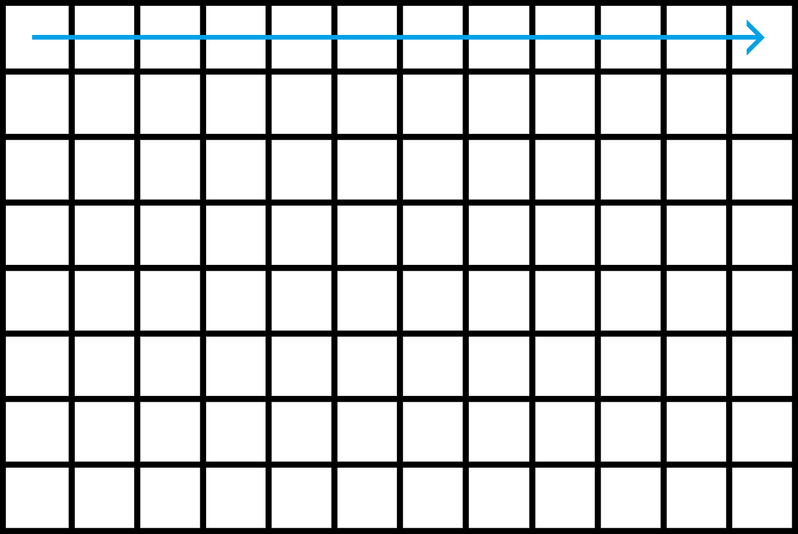
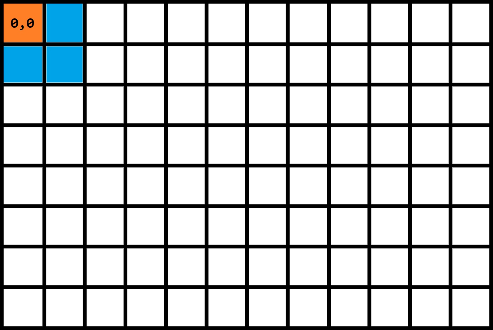
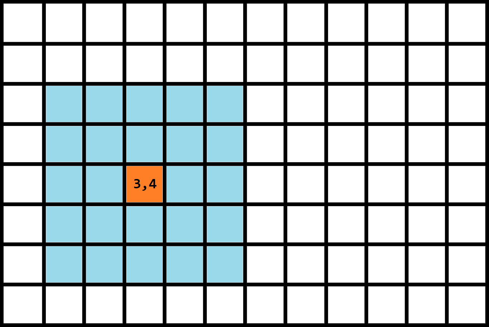

# Detecting Light Sources in an Image

## 

**Parcours**

**Voinsinage de taille 1 d'un pixel à 0,0**

**Voinsinage de taille 2 d'un pixel à 3,4**

## Perspectives
 - [x] Detect light sources
 - [ ] Detect intensity
 - [ ] Detect light direction
